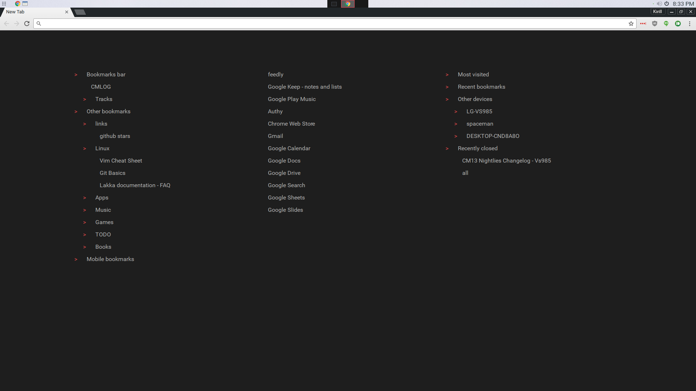

## dotfiles

### theme
* **colors** _custom_
* **fonts** _Roboto_
* **wallpaper** *[from pixabay](https://pixabay.com/en/mountain-clouds-landscape-nature-983914/)*
* **gtk theme** *Iris Dark*
* **icons** *Paper*

### software
* **arch** *gnu/linux distro*
* **budgie** *desktop environment*
* **rxvt-unicode-24bit** *terminal emulator* with full color support
* **zsh** *shell*
* **rofi** *launcher*
* **nautilus** *file manager*
* **gnu stow** *dotfiles/symlink manager*

#
* **google chrome** *browser*
  * **humble new tab page** *start page*
  * **modern flat** *theme*

#
* **mpd** *music daemon*
  * **ncmpcpp** *mpd frontend*
  * **GMusicProxy** *google play music for mpd*
  * **gmpplay** *helper for GMusicProxy*

#
* **vim** *text editor*
  * **vim-plug** *plugin manager*
  * **lightline.vim** *status line*
  * **syntastic** *linter*
  * **supertab** *tab completion*
  * **gruvbox** *theme* used as base with customized colors
  * **vim-commentary** *comment out stuff*
  * **vim-gitgutter** *git diff viewer*

### scripts
* **bootstrap** symlinks this repository into the appropriate locations using gnu stow. Also modifies certain files for use on OSX
* **ricemyride** generates configs for Xresources, vim, etc.
* **spectrum** prints the color spectrum in a terminal supporting true color
